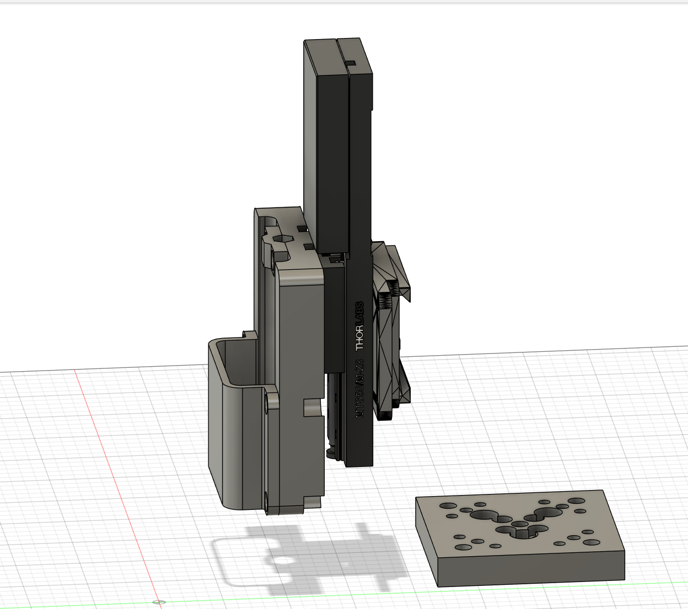

These files provide a way to mount the NewAE ChipShouter to a ThorLabs MTS50/M-Z8 motorized Z Stage. Parts of the design are modified versions from parts that can be found at https://github.com/newaetech/ChipSHOUTER.
For our purpose, we made the top plate more robust and added countersinks. Furthermore, we added a slit to the base plate that can hold a STABILO point 88 Fineliner for leveling the XY bed in respect to the Z stage.
The files also contain a plate that allows to mount the top of a MTS50/M-Z8 X or Y Stage to a MSB1823/M breadboard using a MTSA1/M translation plate from ThorLabs.

